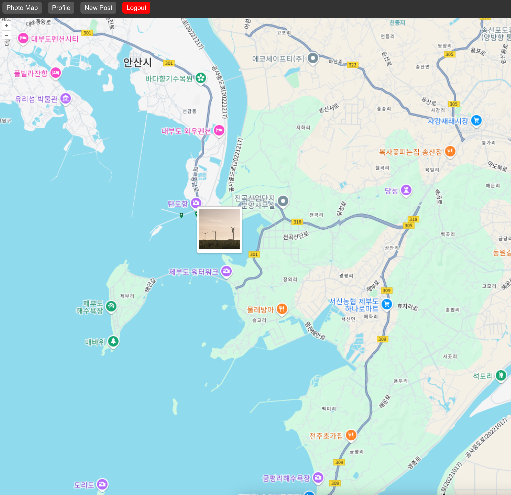
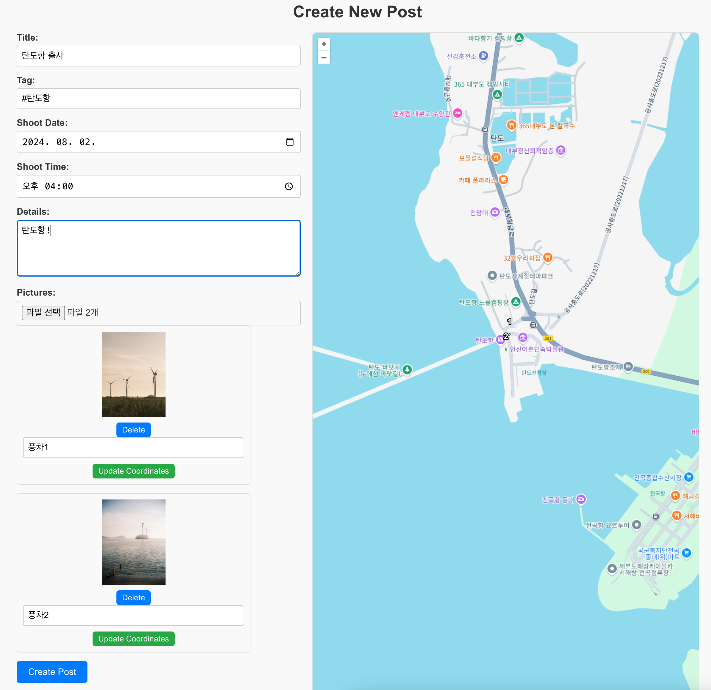
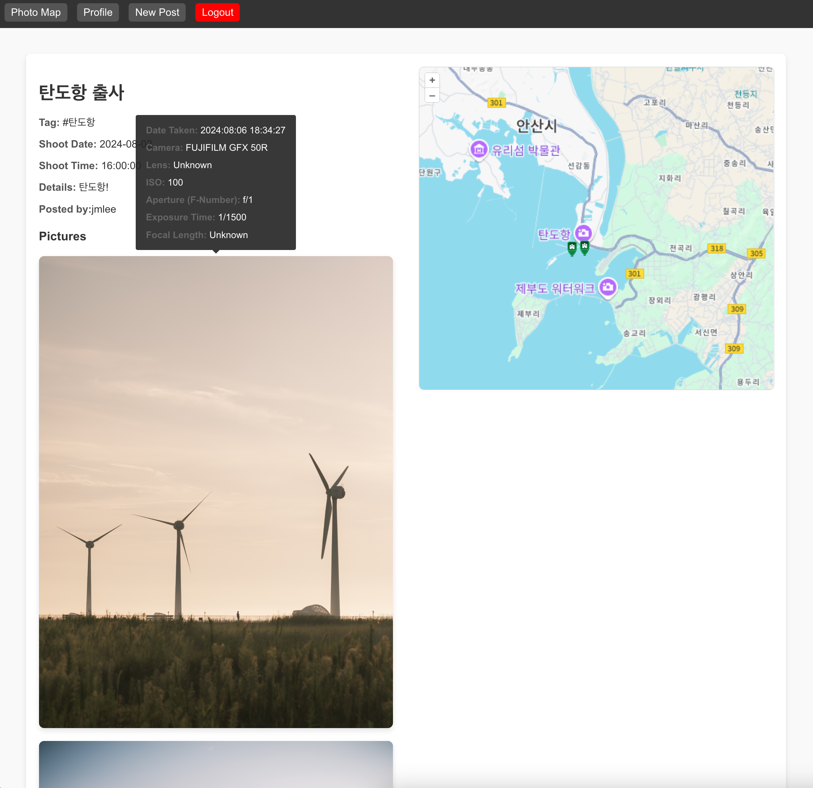
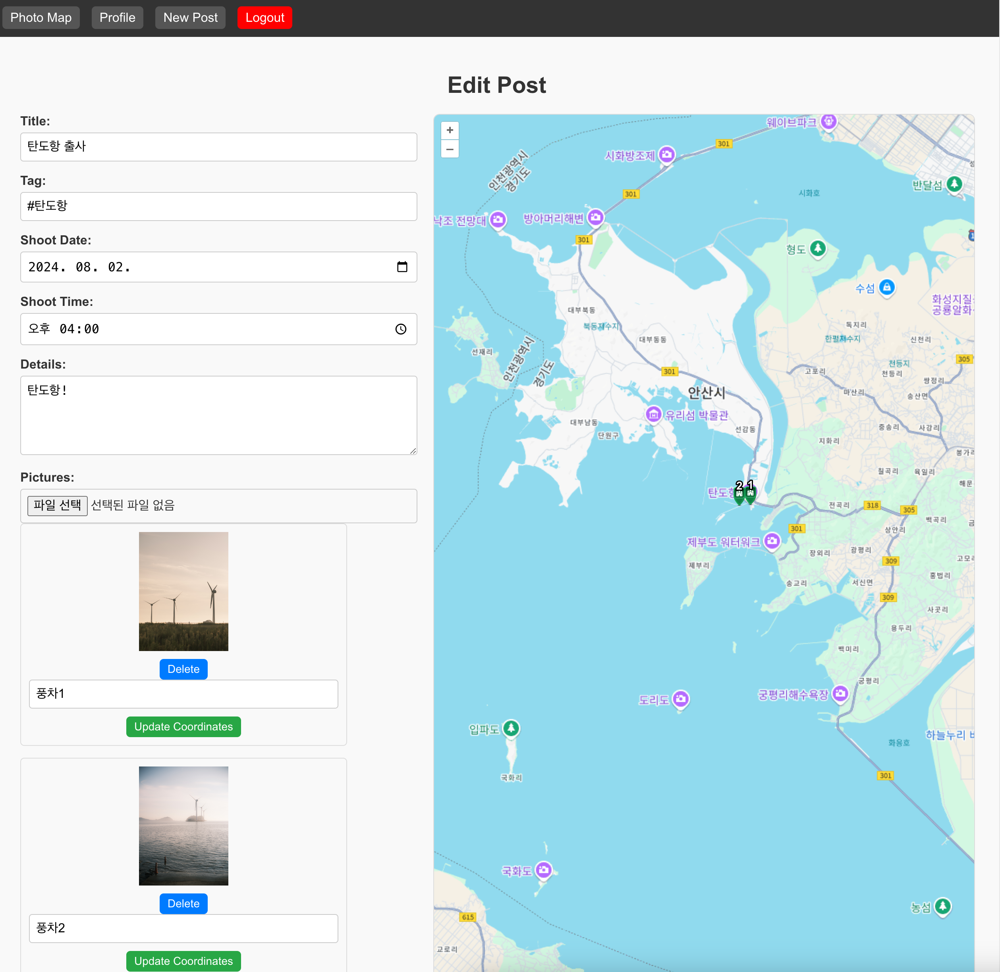
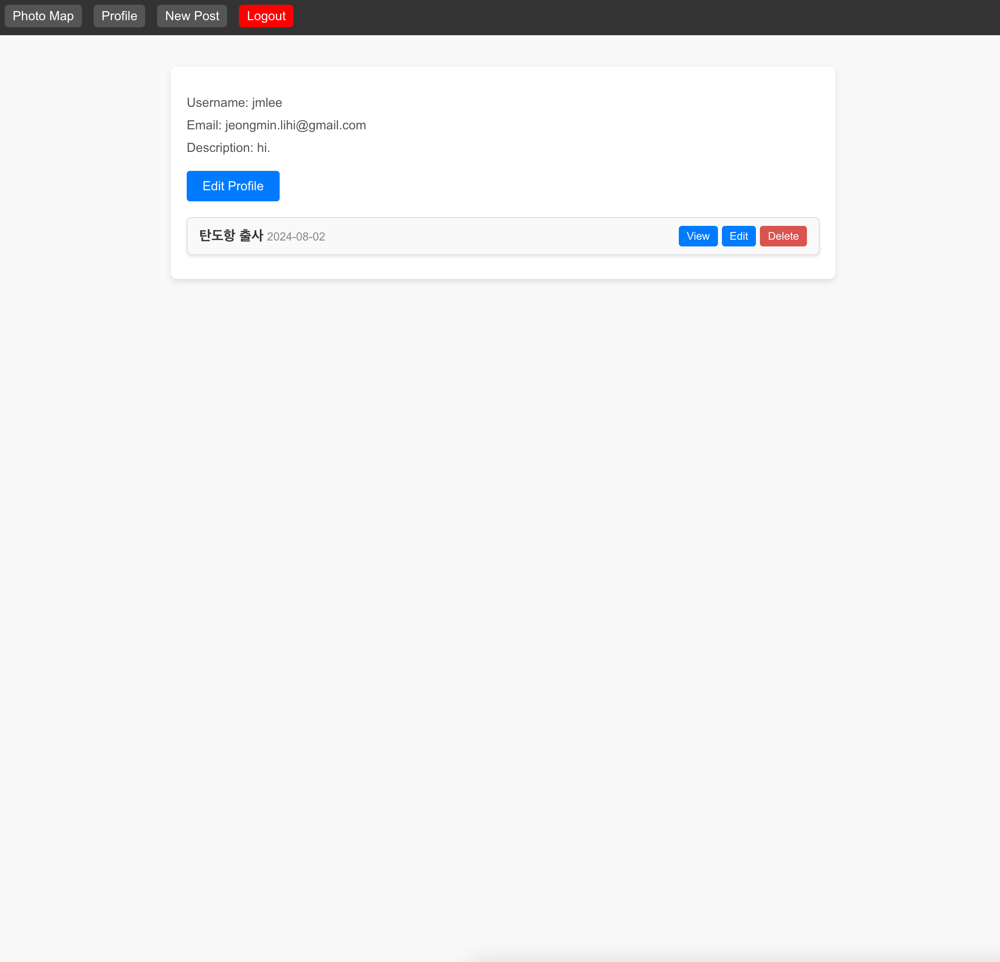

# PhotoMap-Front-End
**This is Front-End part of PhotoMap**
## What is PhotoMap?
PhotoMap은 사진가들을 위한 공간입니다.

일반적인 사진 공유 사이트와 달리, PhotoMap에서는 사진을 업로드하고, 출사 지도를 만들 수 있습니다.

회원가입, 로그인, 업로드, 수정, 삭제 기능을 지원하며, 메인페이지에서는 모든 유저가 올린 사진들을 하나의 지도에서 볼 수 있습니다.

Post 페이지에서는, 업로드한 사진들, 사진들의 메타데이터, 촬영한 장소를 볼 수 있습니다.

## Usage

## Project Files
- MainMap
- SignIn
- SignUp
- User
- CreatePost
- EditPost

## Used Libraries
- OpenLayers: for map
- ExifReader: for showing image meta data

